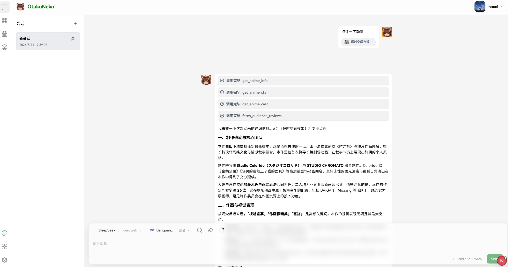
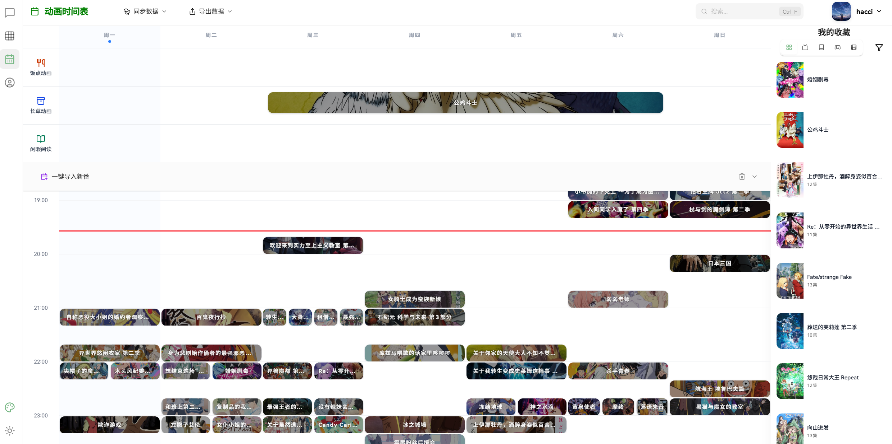
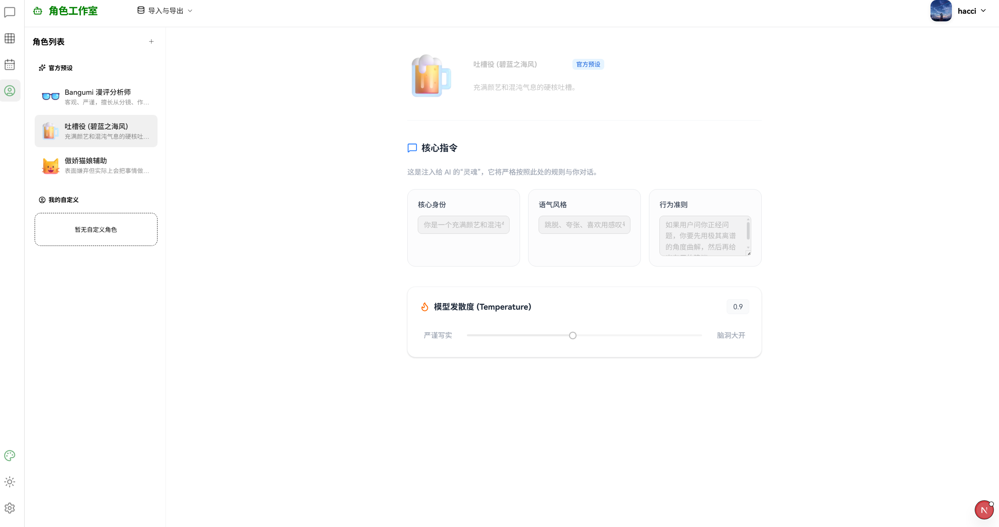

<div align="center">


# 🐱 OtakuNeko | 御宅猫

### *你的二次元赛博哈基米 —— 基于 LLM 的智能化私人番剧管理与分析助手*

<br>

<p>
    <a href="https://www.python.org/">
        
    </a>
    <a href="https://fastapi.tiangolo.com/">
        
    </a>
    <a href="https://nextjs.org/">
        
    </a>
    <a href="https://react.dev/">
        
    </a>
    <a href="https://langchain.com/">
        
    </a>
    <a href="https://www.sqlite.org/">
        
    </a>
    <a href="https://www.postgresql.org/">
        
    </a>
    <a href="./LICENSE">
        
    </a>
</p>

<p>
    <b>OtakuNeko</b> 不仅仅是一个个人助手，它是你的赛博看番搭子 🐱<br>
    它能同步 <b>Bangumi (bgm.tv)</b> 收藏，通过 AI 深度分析你的二次元成分，<br>
    提供智能推荐、排班管理，以及真正懂你的番剧聊天助手。
</p>

<br>

*如果该项目对你也有用，欢迎 ⭐ star & 🍴 fork*

<br>

</div>

---

## 🔥 V2 全新重构

> **2026 年，OtakuNeko 从零重写，彻底进化。**

> ⚠️ **Beta 警示**：当前版本处于开发早期，功能迭代频繁，Bug 较多。建议具备一定开发能力的小伙伴先行体验，暂不保证完整体验。如遇问题欢迎提 Issue！

如果你来自 V1 时代（Streamlit 单页应用），这里是你需要知道的一切：

| 维度 | V1 (Streamlit) | V2 (FastAPI + Next.js) |
|------|:---:|:---:|
| **前端框架** | Streamlit 单页 | Next.js 16 App Router + React 19 |
| **后端框架** | Streamlit 内嵌 | FastAPI 独立服务 (~30 API) |
| **AI 引擎** | LangChain 简单链 | LangGraph ReAct Agent + 7 Tools |
| **数据库** | JSON 文件存储 | SQLite / PostgreSQL 双模式 |
| **部署方式** | 双击 .bat 本地运行 | Docker 一键编排 + 双模式 |
| **UI 体验** | Streamlit 默认组件 | @lobehub/ui + antd + Tailwind |
| **状态管理** | Session State | Zustand 持久化 |
| **特色功能** | 画像 + 报告 | + 实时聊天 + 排班拖拽 + 收藏管理 |
| **平台支持** | Windows 优先 | Windows / macOS / Linux / Docker |

### 🎯 核心升级亮点

- **🏗️ 前后端分离架构** — FastAPI 提供 RESTful + SSE 流式 API，Next.js 承载现代化 UI，各司其职
- **🧠 LangGraph ReAct Agent** — 从简单 LLM 链升级为具备 7 个 Tool 的思考-行动循环智能体
- **💬 实时 AI 聊天** — 基于 SSE 流式传输，Tool Calling 过程可视化，支持多模型/多角色切换
- **📅 可视化排班表** — @dnd-kit 拖拽交互，CSV/iCal/TickTick 日历导出
- **📚 收藏管理系统** — 网格/列表双视图，Bangumi + 豆瓣双平台同步，智能搜索筛选
- **🐳 生产级部署** — Docker Compose 一键编排 5 个服务（DB / Redis / Backend / Frontend / QB）
- **🔐 JWT 认证体系** — bcrypt 密码哈希 + JWT Token + BYOK（自带 API Key）
- **⚡ 双模式数据库** — 开发用 SQLite 零依赖即开即用，生产用 PostgreSQL + Redis 高可用

---

## 📋 目录

- [🔥 V2 全新重构](#-v2-全新重构)
- [✨ 核心功能](#-核心功能)
- [📸 界面预览](#-界面预览)
- [🚀 快速开始](#-快速开始)
- [⚙️ 配置说明](#️-配置说明)
- [🏗️ 架构概览](#️-架构概览)
- [🛠️ 技术栈](#️-技术栈)
- [📂 项目结构](#-项目结构)
- [📖 使用指南](#-使用指南)
- [🧩 开发路线](#-开发路线)
- [📜 License](#-license)

---

## ✨ 核心功能

<table>
<tr>
    <td width="50%">
        <h3>🧠 AI 智能聊天</h3>
        <ul>
            <li>基于 LangGraph ReAct 工作流的动漫领域 AI 助手</li>
            <li>多轮对话 + Tool Calling 可视化（查条目、搜声优、看评价）</li>
            <li>支持多模型切换（DeepSeek / OpenAI / 兼容 API）</li>
            <li>自定义 AI 角色人格预设（毒舌猫娘、柔情猫娘、圆头耄耋）</li>
        </ul>
    </td>
    <td width="50%">
        <h3>📚 收藏管理</h3>
        <ul>
            <li>一键同步 Bangumi 全量收藏（想看/在看/看过/搁置/抛弃）</li>
            <li>网格/列表双视图切换，类型/状态/排序多维筛选</li>
            <li>智能搜索，快速定位你的任何一部番剧</li>
            <li>多数据源支持：Bangumi + 豆瓣双平台导入</li>
            <li>一键 qBittorrent + RSS 智能订阅，自动匹配字幕组追番下载</li>
            <li>B 站跳转检索，快速定位番剧资源与社区讨论</li>
        </ul>
    </td>
</tr>
<tr>
    <td width="50%">
        <h3>📅 放送排班表</h3>
        <ul>
            <li>可视化新番时间网格，本周/下周一目了然</li>
            <li>拖拽式排班管理（<code>@dnd-kit</code> 驱动）</li>
            <li>标准通道视图（巴哈/B站/Netflix/Disney+ 等）</li>
            <li>日历导出：CSV / iCal / TickTick 智能订阅</li>
        </ul>
    </td>
    <td width="50%">
        <h3>🎭 AI 深度画像</h3>
        <ul>
            <li>基于收藏数据的二次元成分鉴定（雷达图 + 饼图）</li>
            <li>AI 生成年度动画报告（4×3 精美海报）</li>
            <li>四象限口味分析（大众 vs 冷门、新作 vs 经典）</li>
            <li>一键导出格子图，便于朋友圈分享</li>
        </ul>
    </td>
</tr>
<tr>
    <td width="50%">
        <h3>🔗 外部数据同步</h3>
        <ul>
            <li>Bangumi API 官方数据源（条目/收藏/角色/Staff）</li>
            <li>Bangumi HTML Scraper（短评/长评抓取）</li>
            <li>bangumi-data CDN 放送时间自动同步（±90 天）</li>
            <li>qBittorrent RSS 订阅集成</li>
        </ul>
    </td>
    <td width="50%">
        <h3>🔌 双模式部署</h3>
        <ul>
            <li><b>本地模式</b>：SQLite + 内存缓存，零依赖，即开即用</li>
            <li><b>云模式</b>：PostgreSQL + Redis + Docker Compose，生产就绪</li>
            <li>Docker 容器化一键部署</li>
            <li>Next.js API Routes 代理 + JWT 鉴权</li>
        </ul>
    </td>
</tr>
</table>

---

## 📸 界面预览

<div align="center">

<table>
  <tr>
    <td align="center" width="50%">
      <br/>
      <em>AI 多轮对话 + Tool Calling</em>
    </td>
    <td align="center" width="50%">
      <br/>
      <em>网格/列表双视图</em>
    </td>
  </tr>
  <tr>
    <td align="center" width="50%">
      <br/>
      <em>拖拽式新番排班</em>
    </td>
    <td align="center" width="50%">
      <br/>
      <em>自定义角色人格</em>
    </td>
  </tr>
</table>

</div>


---

## 🚀 快速开始

OtakuNeko 提供多种启动方式，无论你是普通用户还是开发者，都能找到适合自己的方案。

### 方式一：本地开发模式 ⭐ 推荐

适合所有用户进行开发、调试或日常使用。

**前置条件：**
- Python 3.11+
- Node.js 20+
- pnpm（`corepack enable && corepack prepare pnpm@latest --activate`）
- uv（`powershell -c "irm https://astral.sh/uv/install.ps1 | iex"`）

> **💡 提示：** `start_all.bat` 会自动检测并安装 pnpm。如果遇到 npm 权限错误（如无法写入 `node_cache`），请先手动运行上方 corepack 命令安装 pnpm，或右键 **以管理员身份运行** `start_all.bat`。

```bash
# Windows（一键启动前后端）
start_all.bat

# macOS / Linux（一键启动前后端）
./start_all.sh

# 或手动启动：
# 1. 仅启动基础设施（数据库 + Redis）
dev_infra.bat

# 2. 分别启动前后端（新窗口）
# 后端：cd backend && uv run uvicorn app.main:app --reload --host 0.0.0.0 --port 8000
# 前端：cd frontend && pnpm dev
```

启动后访问：
- **前端页面**：`http://localhost:3000`
- **后端文档**：`http://localhost:8000/docs`

> 本地开发模式下，后端默认使用 SQLite 数据库，无需安装 PostgreSQL。

### 方式二：Docker 一键部署

> ⚠️ **注意：** 由于项目版本变动频繁，Docker 镜像及相关配置可能无法保证随时可用。如遇启动失败，请优先使用 **方式一（本地开发模式）**。

适合想要快速体验完整容器化功能的用户。

**前置条件：** 安装 [Docker Desktop](https://www.docker.com/products/docker-desktop/)

```bash
# Windows
start_docker.bat

# macOS / Linux
./start_docker.sh
```

启动后访问：
- **前端页面**：`http://localhost:3000`
- **后端文档**：`http://localhost:8000/docs`
- **数据库**：localhost:5432（用户 `otaku` / 密码 `password`）

> Docker Compose 将自动启动 5 个服务：`db` (PostgreSQL)、`redis` (Redis)、`backend` (FastAPI)、`frontend` (Next.js)、`qbittorrent` (BT 下载器)。

### 方式三：仅启动基础设施

> ⚠️ **注意：** 由于项目版本变动频繁，基础设施独立启动可能无法保证兼容性。如遇问题，请优先使用 **方式一（本地开发模式）**。

如果你已经配置好前后端环境，只需要数据库和缓存：

```bash
dev_infra.bat
```

这条命令会启动 PostgreSQL (`localhost:5432`) 和 Redis (`localhost:6379`)。

---

## ⚙️ 配置说明

### 环境变量配置

复制根目录的 `.env.example` 为 `.env`，根据需要修改配置：

```ini
# === 部署模式 ===
DEPLOY_MODE=local              # local | cloud

# === LLM 配置 ===
OPENAI_API_KEY=your-api-key   # DeepSeek / OpenAI / 兼容 API
OPENAI_API_BASE=https://api.deepseek.com  # API 端点

# === 本地模式 (SQLite) ===
SQLITE_FILE=./test.db

# === 云模式 (PostgreSQL) ===
POSTGRES_HOST=localhost
POSTGRES_PORT=5432
POSTGRES_USER=otakuneko
POSTGRES_PASSWORD=password123
POSTGRES_DB=otakuneko_db
REDIS_URL=redis://localhost:6379/0

# === JWT 安全 ===
JWT_SECRET_KEY=your-strong-secret-key

# === Bangumi API ===
BANGUMI_TOKEN=your-bangumi-token  # 可选，不填则使用公开数据

# === qBittorrent ===
QB_URL=http://localhost:8080
QB_USERNAME=admin
QB_PASSWORD=adminadmin
```

### 双模式说明

| 模式 | 数据库 | 缓存 | 适用场景 |
|------|--------|------|----------|
| **local** | SQLite | 内存缓存 | 个人使用、开发调试、零依赖 |
| **cloud** | PostgreSQL | Redis | 生产部署、多用户、高可用 |

---

## 🏗️ 架构概览

### 分层架构拓扑

```
┌─────────────────────────────────────────────────────────────┐
│                     Frontend (Next.js 16)                    │
│  ┌──────────┐  ┌──────────┐  ┌──────────┐  ┌────────────┐  │
│  │   Chat   │  │Collection│  │Timetable │  │  Personal  │  │
│  │   Page   │  │   Page   │  │   Page   │  │    Page    │  │
│  └────┬─────┘  └────┬─────┘  └────┬─────┘  └─────┬──────┘  │
│       │             │             │               │         │
│  ┌────▼─────────────▼─────────────▼───────────────▼──────┐  │
│  │              Services Layer (API Client)                │  │
│  │   auth / collections / schedule / bangumi / search     │  │
│  └─────────────────────┬──────────────────────────────────┘  │
└────────────────────────┼─────────────────────────────────────┘
                         │ HTTP / SSE
┌────────────────────────┼─────────────────────────────────────┐
│                 FastAPI Backend (Python)                      │
│  ┌──────────┐  ┌──────▼──────┐  ┌────────────────────────┐  │
│  │  Agent   │  │  API Layer  │  │  Auth (JWT + bcrypt)    │  │
│  │ LangGraph │  │  9 Routers  │  │  Security Layer        │  │
│  │ ReAct + 7 │  │  ~30 APIs   │  └────────────────────────┘  │
│  │  Tools   │  └──────┬──────┘                               │
│  └──────────┘         │                                       │
│  ┌────────────────────▼────────────────────────────────────┐  │
│  │              Service Layer (11 Services)                  │  │
│  │  Bangumi / Collection / Subject / Schedule / Stats       │  │
│  │  UserProfile / Douban / QB / DataSync / User            │  │
│  └────────────────────┬────────────────────────────────────┘  │
│                       │                                       │
│  ┌────────────────────▼────────────────────────────────────┐  │
│  │         Repository Layer (4 Repos) + SQLModel ORM        │  │
│  │  SubjectRepo / CollectionRepo / UserRepo / ScheduleRepo  │  │
│  └────────────────────┬────────────────────────────────────┘  │
│                       │                                       │
│           ┌───────────┴───────────┐                           │
│           │     SQLite / PgSQL    │                           │
│           └───────────────────────┘                           │
└─────────────────────────────────────────────────────────────┘
```

### 数据流全景

```
用户 → Next.js Page  →  Services  →  HTTP/SSE  →  FastAPI Router
                                                    ↓
                                            JWT Auth (deps.py)
                                                    ↓
                                            Service Layer (编排)
                                                    ↓
                                            Repository (CRUD)
                                                    ↓
                                            SQLite / PostgreSQL

AI 聊天特殊链路：
用户 → ChatPage  →  SSE Stream  →  LangGraph ReAct Agent
                                      ↓
                                Tool Calls (7 tools)
                                      ├── Bangumi API / Scraper
                                      ├── User Profile Service
                                      └── Local Time
```

### Agent 工作流

```
用户消息 → LangGraph ReAct Agent
    → Agent Node: LLM 推理
        → 决定调用 Tool?
            ├── YES → Tool Node 执行
            │          → 调用 Service 层实际逻辑
            │          → 结果返回 Agent 继续推理
            └── NO  → END → 流式返回最终回复
```

**7 个内置工具：**

| Tool | 功能 | 数据来源 |
|------|------|----------|
| `get_anime_info` | 查询动画条目信息 | Bangumi API |
| `fetch_audience_reviews` | 获取观众短评/长评 | Bangumi HTML Scraper |
| `get_anime_staff` | 查询动画制作人员 | Bangumi API |
| `get_anime_cast` | 查询动画声优阵容 | Bangumi API |
| `search_anime_advanced` | 高级搜索动画条目 | Bangumi API |
| `get_current_time` | 获取当前时间 | 本地系统时钟 |
| `generate_user_profile_tool` | 生成用户画像分析 | 数据库 + LLM |

### 外部集成全景

```
OtakuNeko
    │
    ├── Bangumi API (api.bgm.tv)          ─ 条目/收藏/角色/Staff
    ├── Bangumi Web (bgm.tv HTML)         ─ 短评/长评抓取
    ├── bangumi-data CDN                  ─ 放送时间同步
    ├── 豆瓣 API                           ─ 收藏导入
    ├── qBittorrent                       ─ RSS 订阅下载
    └── OpenAI / 兼容 API                  ─ LLM 推理
```

---

## 🛠️ 技术栈

### 后端 (Backend)

| 类别 | 技术 | 用途 |
|------|------|------|
| 框架 | **FastAPI** 0.109+ | RESTful API + SSE 流式响应 |
| ORM | **SQLModel** + **SQLAlchemy** | 异步 ORM，6 张业务表 |
| AI Agent | **LangGraph** 1.0+ | ReAct 工作流编排 |
| LLM SDK | **LangChain-OpenAI** | 统一 LLM 调用接口 |
| 数据库 | **SQLite** (本地) / **PostgreSQL** (生产) | 双模式自动切换 |
| 缓存 | **fastapi-cache2** (内存/Redis) | API 响应缓存 |
| 迁移 | **Alembic** | 数据库版本管理 |
| 认证 | **python-jose** + **passlib(bcrypt)** | JWT + 密码哈希 |
| 爬虫 | **httpx** + **BeautifulSoup4** | Bangumi HTML Scraper |
| 包管理 | **uv** | 新一代 Python 包管理器 |
| 任务队列 | **Celery** (计划中) | 定时同步/离线计算 |

### 前端 (Frontend)

| 类别 | 技术 | 用途 |
|------|------|------|
| 框架 | **Next.js** 16.1 (App Router) | React SSR + API Routes 代理 |
| UI 库 | **React** 19 + **@lobehub/ui** + **antd** | 高质量 UI 组件 + 聊天专用组件 |
| 状态管理 | **Zustand** 5.0 | 轻量级状态管理 |
| 样式方案 | **Tailwind CSS** + **antd-style** | 原子化 CSS + 主题系统 |
| 拖拽 | **@dnd-kit** 6.3 | 排班表拖拽交互 |
| HTTP | **fetch** + **axios** | API 请求 + SSE 流式聊天 |
| 构建 | **Turbopack** + **React Compiler** | 极速构建与编译优化 |
| 包管理 | **pnpm** | 高性能包管理器 |

### 数据层 (Database)

| 表 | 说明 |
|----|------|
| **Subject** | 动画条目（涵盖 Bangumi 全类型） |
| **Collection** | 用户收藏（想看/在看/看过/搁置/抛弃） |
| **User** | 用户账户与认证信息 |
| **Schedule** | 用户自定义排班 |
| **AnimeBroadcastMetadata** | 放送时间元数据（多平台） |

---

## 📂 项目结构

<details>
<summary><b>点击展开完整项目结构</b></summary>

```
OtakuNeko/
│
├── frontend/                    # 🎨 前端 (Next.js 16 + React 19)
│   └── src/
│       ├── app/                 # App Router 页面
│       │   ├── page.tsx         # 首页 → 聊天
│       │   ├── collections/     # 收藏管理页
│       │   ├── Timetable/       # 排班表页
│       │   ├── Personal/        # AI 角色工厂页
│       │   └── api/             # Next API Routes 代理
│       ├── components/          # 业务 UI 组件
│       │   ├── chat/            # 聊天界面组件
│       │   ├── collection/      # 收藏展示组件
│       │   ├── header/          # 各页面 Header
│       │   ├── timetable/       # 排班表拖拽系统
│       │   ├── Modal/           # 全局弹窗
│       │   ├── providers/       # 主题上下文
│       │   └── sidebar/         # 角色侧栏
│       ├── features/            # 功能模块
│       │   ├── Sidebar/         # 主导航侧栏
│       │   └── Theme/           # 主题切换器
│       ├── services/            # API 服务层 (9 文件)
│       ├── lib/                 # 工具库
│       │   ├── fetcher.ts       # SSE 流式聊天
│       │   └── utils.ts         # cn() 类名合并
│       ├── store/               # Zustand 状态管理
│       └── stores/              # 聊天 Store
│
├── backend/                     # ⚙️ 后端 (FastAPI + Python)
│   └── app/
│       ├── api/v1/              # API 路由层 (9 路由, ~30 端点)
│       ├── agents/              # LangGraph Agent + 7 Tools
│       ├── services/            # 业务服务层 (11 服务)
│       ├── repositories/        # 数据仓库层 (4 Repos)
│       ├── models/              # SQLModel ORM (6 表)
│       ├── schemas/             # Pydantic Schema (11 文件)
│       ├── clients/             # 外部客户端 (Bangumi Scraper)
│       ├── core/                # 基础设施 (配置/日志/安全)
│       ├── db/                  # 数据库引擎 (双模式)
│       ├── worker/              # Celery 任务队列 (计划中)
│       └── main.py              # FastAPI 入口
│
├── docker-compose.yml           # 🐳 Docker 编排 (5 服务)
├── .env.example                 # 🔑 环境变量模板
│
├── start_docker.bat / .sh       # Docker 一键启动
├── start_all.bat / .sh          # 本地开发一键启动
├── dev_infra.bat                # 基础设施启动 (DB + Redis)
│
└── docs/                        # 📄 架构文档
    ├── backend-architecture-whitepaper.md
    └── frontend-src-research-report.md
```

</details>

---

## 📖 使用指南

### 🧠 AI 聊天

进入首页即可与 AI 助手对话。支持：

- **自然语言查询**：`"查一下《命运石之门》的制作人员"`、`"推荐几部类似《进击的巨人》的番"`
- **角色人格切换**：在侧栏选择毒舌猫娘、柔情猫娘或圆头耄耋
- **多模型切换**：在输入框上方选择不同的 LLM 模型
- **Tool Calling 可视化**：AI 调用工具时实时展示调用过程和结果

### 📚 收藏管理

1. 首次使用点击"同步 Bangumi 收藏"
2. 输入你的 Bangumi 用户名（可选填 API Token 获取更多数据）
3. 同步完成后即可在网格/列表视图中浏览你的全部收藏
4. 使用筛选器按类型、状态、排序快速定位

### 📅 放送排班表

- 自动同步当季新番放送时间
- 支持拖拽调整追番计划
- 一键导出为 CSV / iCal / TickTick 订阅
- 多平台视图（巴哈姆特/B站/Netflix/Disney+ 等）

### 🎭 AI 深度画像

1. 在聊天中输入 `"生成我的用户画像"` 或类似指令
2. AI 将分析你的收藏数据，生成：
   - **成分鉴定雷达图**：多维度口味可视化
   - **四象限分析**：大众 vs 冷门、新作 vs 经典
   - **年度动画报告**：4×3 精美海报（支持一键下载分享）

---

## 🧩 开发路线

### 短期（1-2 周）
- [ ] 补充用户画像独立 API 端点
- [ ] Agent 工具自动拉取收藏数据（无需前端传入）
- [ ] 四象限结果集成到画像返回值
- [ ] 用户画像添加 TTL 缓存

### 中期（2-4 周）
- [ ] 实现 Celery 定时任务（收藏增量同步、日历定时拉取、放送时间周期更新）
- [ ] 清理 DEBUG 日志与完善模块导出
- [ ] CORS 配置化 + API 速率限制

### 长期（1 月+）
- [ ] Agent 架构升级：ReAct → Plan-and-Execute + 意图路由
- [ ] 引入 RAG（向量数据库 + Embedding）+ Agent Memory（Checkpoint 持久化）
- [ ] 添加单元测试、集成测试、CI/CD Pipeline
- [ ] 前端测试覆盖

---

## 📜 License

本项目采用 [MIT License](./LICENSE) 协议进行开源。

```
MIT License

Copyright (c) 2025-2026 OtakuNeko

Permission is hereby granted, free of charge, to any person obtaining a copy
of this software and associated documentation files...
```

---

<div align="center">
    <br>
    <p>
        <b>OtakuNeko</b> — 让你的二次元生活更加精彩 🐱
    </p>
    <p>
        <sub>Built with ❤️ by otakus, for otakus</sub>
    </p>
    <br>
</div>
