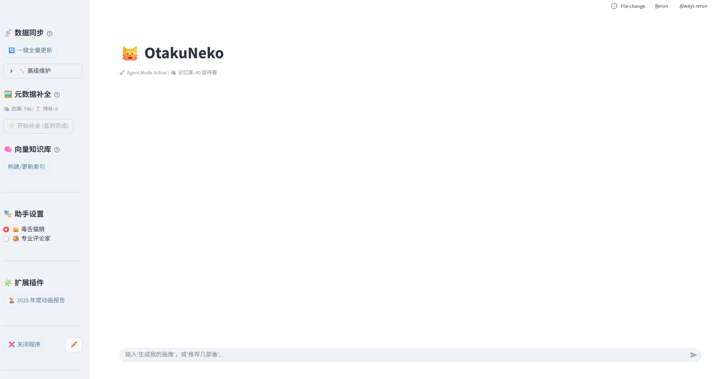
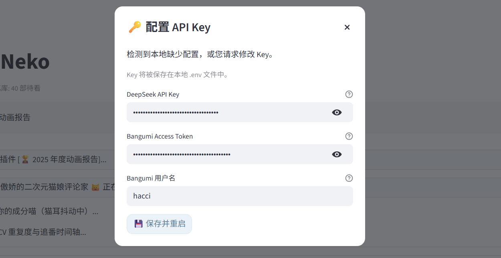
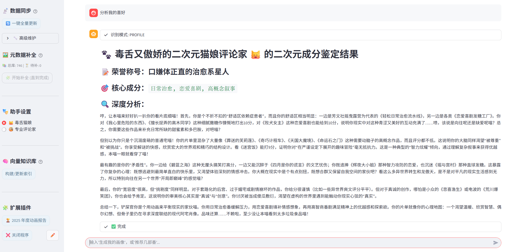
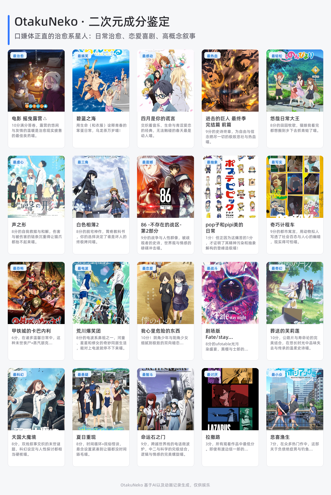
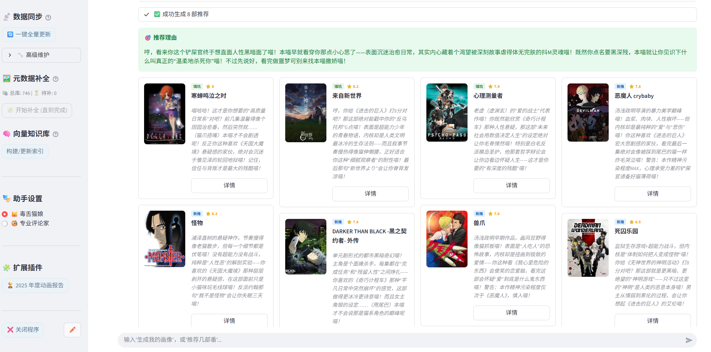
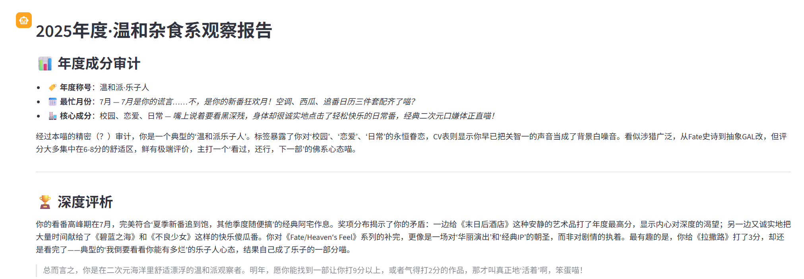
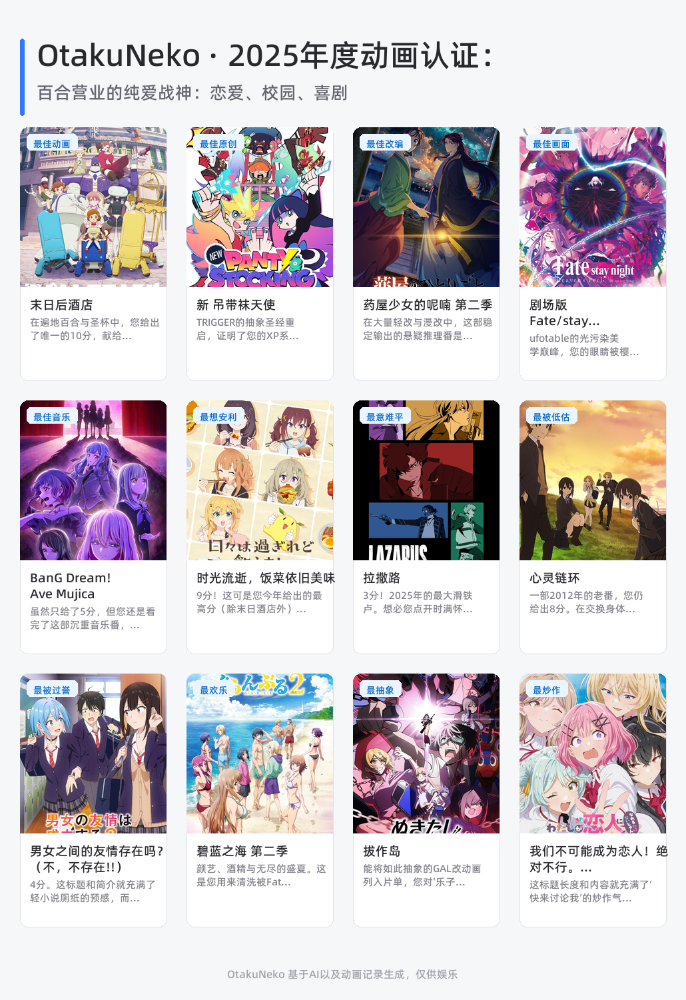

<div align="center">


# 🐱 OtakuNeko | 御宅猫

*你的二次元赛博哈基米 —— 基于 LLM 的智能化私人番剧管理与分析助手*

**中文 | [English](README_EN.md)**

<p>
    <a href="https://www.python.org/">
        
    </a>
    <a href="https://streamlit.io/">
        
    </a>
    <a href="#">
        
    </a>
    <a href="LICENSE">
        
    </a>
</p>

<p>
    <b>OtakuNeko 不仅仅是一个LLM。</b><br>
    它能同步你的 Bangumi 收藏，利用 AI 深度分析你的看番口味，<br>
    生成精美的年度总结海报，并提供真正懂你的番剧推荐。
</p>

<br>

*如果该项目对你有用, 欢迎 star 🌟 & fork 🍴*

<br>

</div>

## ✨ 核心功能

OtakuNeko 旨在解决传统番剧管理工具“只记录不分析”的痛点，通过 LLM 为你的二次元生活赋能。

### 1. 🧠 AI 深度画像
告别枯燥的统计图表，让 AI 告诉你真正的自己。
- **成分鉴定**：生成“纯爱战神”、“乐子人”、“赛博案底”等趣味标签。
- **多重人格**：支持切换 **“毒舌猫娘”** 或 **“专业评论家”** 语调，让分析报告充满“人味”。

### 2. 🏆 年度动画报告
一键生成 4x3 布局的精美年度总结海报，包含 12 个深度维度：
- **深度评选**：年度声优、最忙月份、最佳动画、最意难平...
- **自动绘图**：无需设计，自动抓取封面图并排版，支持一键下载分享。

### 3. 📊 数据同步 & 智能推荐
- **无感同步**：一键拉取 Bangumi (bgm.tv) 收藏，自动整理“看过/在看/想看”。
- **向量推荐**：基于向量数据库 (Vector Store)，告别大众榜单，推荐符合你口味的冷门佳作。

---

## 📸 界面预览

<div align="center">
    
    <br>
    <i>OtakuNeko 控制台界面预览</i>
</div>

---

## 🛠️ 快速开始

无需掌握复杂的命令行，我们为 Windows 用户提供了极致的懒人启动方案。

### 0. python安装
请确保你已经安装了python（[点击下载](https://www.python.org/downloads/)），暂无版本要求


### 1. 环境初始化
在项目根目录下，双击运行脚本：
```bash
Setup.bat
```

> ⏳ **说明**：脚本会自动创建 Python 虚拟环境并安装所有依赖，仅需初次运行一次。

### 2. 启动程序双击运行脚本：

```bash
Run.bat
```
> 🎉 **成功**：程序将在后台静默运行，并自动在浏览器打开 `http://localhost:8501`。
### 3. 配置 API Key
在弹出的框里，填入你的 DeepSeek API Key（[点击获取](https://platform.deepseek.com/)）（目前仅支持OpenAI接口的模型），Bungumi token（非必要）（[点击获取](https://next.bgm.tv/demo/access-token)），Bungumi的用户名。
> ⚠️deepseek api需要付费，请自行斟酌。

<div align="center">
    
    <br>
    <i>OtakuNeko api界面预览</i>
</div>

---

## 📂 目录结构
```text
OtakuNeko/
├── data/                  # 📦 数据存储 (JSON数据集、生成的年度海报)
├── src/                   # 🧠 核心源码
│   ├── agent/             # AI 智能体 (Profile, Recommend, YearReport)
│   ├── plugins/           # 插件系统
│   └── config/            # 语气、人格、Prompt配置
├── venv/                  # 🐍 虚拟环境 (自动生成)
├── app.py                 # 🚀 Streamlit 主入口
├── .env                   # 🔑 配置文件
├── Setup.bat           # 🛠️ 环境初始化脚本
├── Run.bat           # 💻 调试启动脚本 (带黑窗口)
└── Run.vbs         # ✨ 静默启动脚本 (暂不推荐，有问题)

```

## 📖 使用指南
### 基本指南

| 模块 | 操作说明 |
| :--- | :--- |
| **控制台 (Sidebar)** | • **🔄 一键全量更新**：初次使用或看完新番后同步数据<br>• **🖼️ 元数据补全**：补充更新动画的 Staff 和声优信息，影响推荐准确度<br> • **🧩 扩展插件**：点击生成“2025 年度动画报告”<br>• **🎭 助手风格**：随时切换 AI 说话风格 |
| **对话框 (Chat)** | 直接输入自然语言指令，例如：<br>• “分析一下我最近的看番口味”<br>• “推荐几部剧情像《命运石之门》一样的番” |
| **关闭程序** | 使用完毕后，**务必**点击侧边栏底部的 **“❌ 关闭程序”** 按钮以释放后台资源。 |

### 生成用户画像
输入类似指令，如生成用户画像，或者分析我的喜好等，判断模式为`PROFILE`后进入模式。进入模式后，会将你的看过和抛弃的动画全部扔给AI进行分析，生成成分鉴定表。

<div align="center">
    
    <br>
    <i>OtakuNeko 生成用户画像</i>
</div>

<div align="center">
    
    <br>
    <i>OtakuNeko 用户画像的格子图</i>
</div>

### 推荐动画
进行推荐动画前，**请一定要生成用户画像**，不然没办法知道用户喜好。为了避免token爆炸，这里采用下面的逻辑推荐：
```
LLM根据输入指令输出标签->根据标签进行RAG检索->匹配动画+想看+搁置+用户画像输入LLM
```
事实上，还会采用最近两年内的观看记录作为绝对不能推荐的去重策略，尽管如此还是会有看过的动画推荐出来，因此有概率会出现让你重温的动画推荐。
> ⚠️ 对于声优、导演的动画推荐不太准确，这可能对于声豚是个坏消息。

<div align="center">
    
    <br>
    <i>OtakuNeko 生成用户画像</i>
</div>


### 年度动画推荐
这实际上是作为一个生成用户画像的衍生模式进行的。逻辑相似，只不过使用了最近一年你加入bungumi的动画，因此范围不限于今年的新番，而是**今年你看过的所有动画**，更具备特殊性。点击2025年度动画报告即可触发。

<div align="center">
    
    <br>
    <i>OtakuNeko 生成年度动画报告</i>
</div>


<div align="center">
    
    <br>
    <i>OtakuNeko 年度动画的格子图</i>
</div>

## 📝 FAQ
<details>
<summary><strong>Q: 启动时命令行提示中文乱码？</strong></summary>
A: 这是一个 Windows 已知问题。请直接使用 <code>无窗口启动.vbs</code> 启动，或者直接双击 <code>启动程序.bat</code>（脚本内已内置 UTF-8 修复），不要在 PowerShell 中手动运行。
</details>

<details>
<summary><strong>Q: 年度报告生成失败或图片加载不出？</strong></summary>
A: 生成海报需要访问 Bangumi 的图片服务器，请确保你的网络环境可以正常访问 bgm.tv 的图片资源。
</details>

<details>
<summary><strong>Q: 如何更新项目依赖？</strong></summary>
A: 如果项目有更新，再次运行 <code>一键配置.bat</code> 即可自动更新 requirements.txt 中的依赖。
</details>

<details>
<summary><strong>Q: 更新数据缓慢？</strong></summary>
A: 一般来说，全量数据更新是很快的，只有补全声优数据时，才会一个个补充信息，就会变得相当缓慢。如果你是前者，请检查你的网络设置。
</details>


## 📅 更新日志
### v1.1 (2025-12-17)
- ✨ **新增**：
    * 现在bangumi的api变为可选输入，不输入的情况下，获取用户的公开收藏。
    * 新增了柔情猫娘，圆头耄耋两个人格。
- 🐛 **修复**：年度报告不能选择人格的问题。
- 💄 **优化**：优化了傲娇猫娘的人格，现在更有趣味。

<details>
<summary><strong>过往版本的更新日志</strong></summary>

### v1.0(2025-12-16)
- 🎉 **发布**：OtakuNeko 初始版本发布，支持 Bangumi 同步与基础画像分析。
</details>


## 📌TODO
| 选项 | 描述 |
| :---: | :--- |
| ✅ | 页面优化 |
| 🔄 | 圆头耄耋、柔情猫娘人格加入 |
| 🔄 | 优化画像生成的准确性 |
| 🔄 | 年度报告的网页跳转 |
| ⬜ | 排程算法 |
| ⬜ | 支持基于格子图建立用户画像 |
| ⬜ | 格子图一键填充 |
| ⬜ | 支持接入类Gemini API |
| ⬜ | ...... |


## 📜 License
本项目采用 [MIT License](LICENSE) 协议进行开源。

