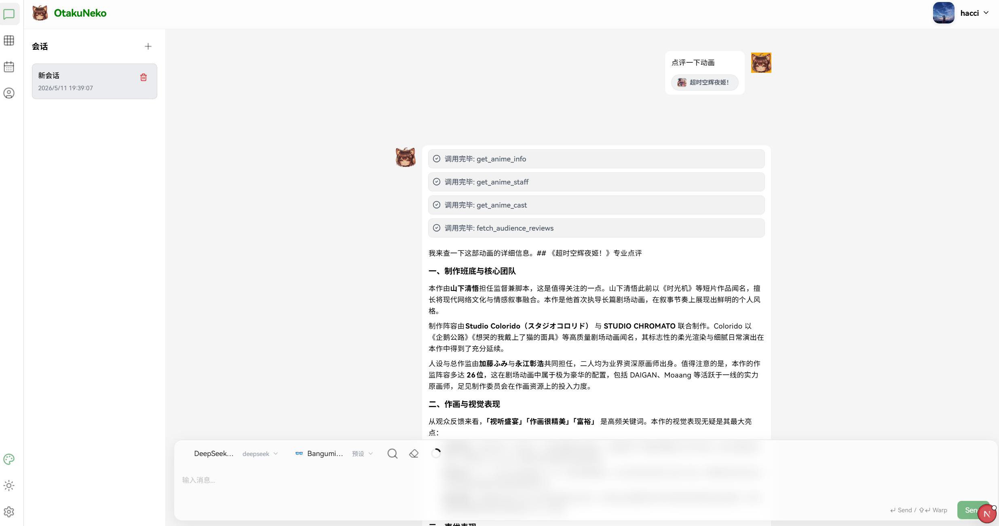
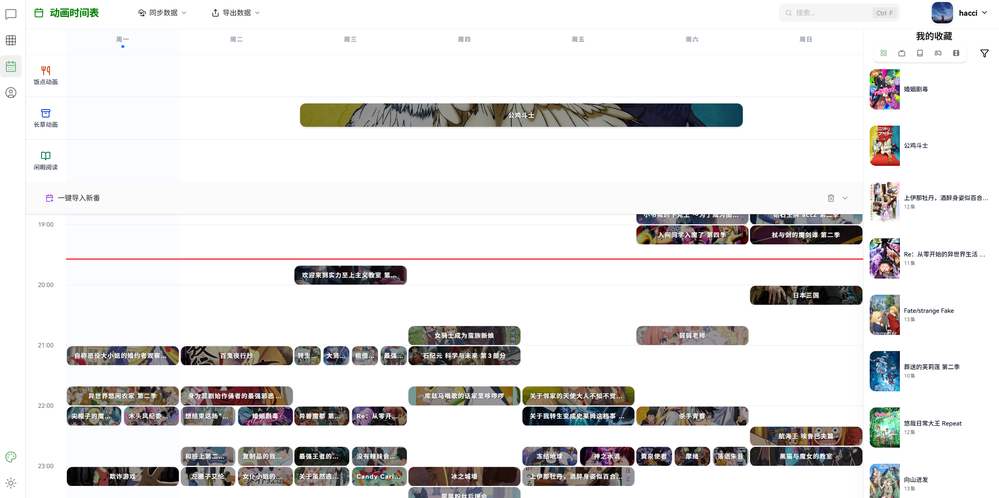
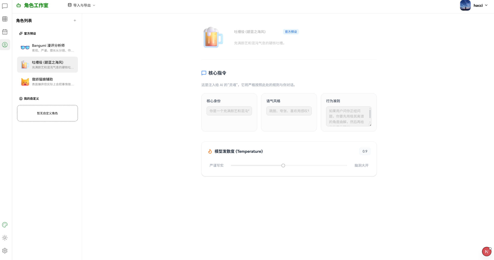

<div align="center">


# 🐱 OtakuNeko | 御宅猫

### *你的二次元赛博哈基米 —— 基于 LLM 的智能化私人番剧管理与分析助手*

<br>

<p>
    <a href="https://www.python.org/">
        
    </a>
    <a href="https://fastapi.tiangolo.com/">
        
    </a>
    <a href="https://nextjs.org/">
        
    </a>
    <a href="https://react.dev/">
        
    </a>
    <a href="docs/architecture/standard-agent-harness-reference.md">
        
    </a>
    <a href="https://www.sqlite.org/">
        
    </a>
    <a href="https://www.postgresql.org/">
        
    </a>
    <a href="./LICENSE">
        
    </a>
</p>

<p>
    <b>OtakuNeko</b> 不仅仅是一个个人助手，它是你的赛博看番搭子 🐱<br>
    它能同步 <b>Bangumi (bgm.tv)</b> 收藏，通过 AI 深度分析你的二次元成分，<br>
    提供智能推荐、排班管理，以及真正懂你的番剧聊天助手。
</p>

<br>

*如果该项目对你也有用，欢迎 ⭐ star & 🍴 fork*

<br>

</div>

---

### Harness — 2026-08-31 <span style="font-size:0.85em;background:#6366f1;color:#fff;padding:2px 8px;border-radius:10px;">Latest</span>

> **🧭 Harness 当前版本：** 在 FastAPI + Next.js 前后端分离基础上，主聊天已切换为 Runtime-owned Decision Loop。LLM 只提出结构化 Decision，Capability、specialist 与外部服务通过受控调度边界执行；MCP server 另有独立的白名单暴露与策略边界；SSE 只投影可持久化的 Run Event。

<details>
<summary><b>📋 展开查看完整亮点</b></summary>
<br>

- **🧭 Runtime-owned Harness**：`AgentRuntime` 统一控制 Decision、预算、取消、checkpoint 和终态
- **🧠 结构化模型决策**：Model Gateway 归一化 Provider，LLM 只能提出版本化 Decision，不能直接执行能力
- **🧩 受控能力执行**：Capability Registry、Policy、Dispatcher 与可信 `ExecutionContext` 共同约束调用
- **💬 AI 实时聊天**：Provider → Gateway → Runtime → SSE → Chat 的流式链路，支持能力过程可视化
- **🗂️ Run/Event 持久化**：认证会话可查询、回放和取消；SSE 不是运行状态的唯一来源
- **📚 收藏管理系统**：Bangumi + 豆瓣双平台同步，网格/列表双视图，智能搜索筛选
- **📅 可视化排班表**：@dnd-kit 拖拽交互，CSV/iCal/TickTick 日历导出
- **🔗 外部集成**：qBittorrent RSS 订阅、B 站跳转检索、bangumi-data 放送同步
- **🐳 容器化部署**：Docker Compose 编排 PostgreSQL、Redis、Backend、Frontend 与 qBittorrent
- **🔐 JWT 认证体系**：bcrypt 密码哈希 + JWT Token + BYOK
- **⚡ 双模式数据库**：SQLite（本地、单 Worker）/ PostgreSQL（容器化部署）

</details>

---

## 🔥 从 V1、V2 到 Harness

> **2026 年，OtakuNeko 从 Streamlit 单页应用演进为前后端分离系统，并继续升级为受控、可恢复、可观测的 Agent Harness。**

> ⚠️ **Beta 警示**：当前版本处于开发早期，功能迭代频繁，Bug 较多。建议具备一定开发能力的小伙伴先行体验，暂不保证完整体验。如遇问题欢迎提 Issue！

如果你来自 V1 或早期 V2，这里用同一套对比方式说明当前 Harness 的变化：

| 维度 | V1（Streamlit） | V2（FastAPI + Next.js） | Harness（当前） |
|------|:---:|:---:|:---:|
| **应用架构** | Streamlit 单页 | FastAPI + Next.js 前后端分离 | 前后端分离 + Agent Harness 控制面 |
| **AI 引擎** | LangChain 简单链 | LangGraph ReAct + 静态 Tools | `AgentRuntime` + Model Gateway + Decision Parser |
| **Run 控制者** | 页面请求 | LangGraph 内部循环 | `AgentRuntime` 唯一推进运行状态与终态 |
| **模型权限** | 生成文本 | 直接产生 Tool Calling | 只提出版本化 Decision，不直接执行 |
| **能力执行** | 内嵌函数 | 静态 Tool 注册 | Registry + Policy + Dispatcher + trusted context |
| **Agent 分工** | 单链 | 单个 ReAct Agent | 主 Runtime + 可选领域 specialist；specialist 不拥有顶层 Run |
| **状态与流式** | Session State | SSE + 会话状态 | canonical Run/Event + checkpoint；SSE 只做投影 |
| **数据库** | JSON 文件 | SQLite / PostgreSQL | SQLite 单 Worker / PostgreSQL，Run/Event 与业务数据分层 |
| **UI 体验** | Streamlit 默认组件 | @lobehub/ui + antd + Tailwind | Runtime Event、Capability 过程与逐帧内容渲染 |
| **平台支持** | Windows 优先 | Windows / macOS / Linux / Docker | Windows / macOS / Linux / Docker |

### 🎯 核心升级亮点

- **🧭 Agent Harness** — Runtime 控制 Run，模型提出 Decision，Dispatcher 执行经过 Schema、Policy 和授权检查的能力
- **💬 实时 AI 聊天** — 基于 canonical Run Event 的 SSE 投影，Capability 调用过程可视化，支持多模型/多角色切换
- **🧠 Provider-neutral Gateway** — 统一 OpenAI-compatible / DeepSeek 模型调用、流式 delta、取消、超时和错误契约
- **🗂️ 可恢复运行边界** — 认证会话持久化 Run、Event 与 checkpoint；本地 SQLite 明确限制为单 Worker
- **📅 可视化排班表** — @dnd-kit 拖拽交互，CSV/iCal/TickTick 日历导出
- **📚 收藏管理系统** — 网格/列表双视图，Bangumi + 豆瓣双平台同步，智能搜索筛选
- **🐳 容器化部署** — Docker Compose 编排 5 个服务（DB / Redis / Backend / Frontend / QB）
- **🔐 JWT 认证体系** — bcrypt 密码哈希 + JWT Token + BYOK（自带 API Key）
- **⚡ 双模式数据库** — 开发用 SQLite 零依赖即开即用，容器化环境使用 PostgreSQL

---

## 📋 目录

- [🔥 从 V1、V2 到 Harness](#-从-v1v2-到-harness)
- [✨ 核心功能](#-核心功能)
- [📸 界面预览](#-界面预览)
- [🚀 快速开始](#-快速开始)
- [⚙️ 配置说明](#️-配置说明)
- [🏗️ 架构概览](#️-架构概览)
- [🛠️ 技术栈](#️-技术栈)
- [📂 项目结构](#-项目结构)
- [📖 使用指南](#-使用指南)
- [🧩 开发路线](#-开发路线)
- [📝 更新日志](#-更新日志)
- [📜 License](#-license)

---

## ✨ 核心功能

<table>
<tr>
    <td width="50%">
        <h3>🧠 AI 智能聊天</h3>
        <ul>
            <li>基于 Runtime-owned Agent Harness 的动漫领域 AI 助手</li>
            <li>多轮 Decision + Capability 调用可视化（查条目、搜声优、看评价）</li>
            <li>支持多模型切换（DeepSeek / OpenAI / 兼容 API）</li>
            <li>自定义 AI 角色人格预设（毒舌猫娘、柔情猫娘、圆头耄耋）</li>
        </ul>
    </td>
    <td width="50%">
        <h3>📚 收藏管理</h3>
        <ul>
            <li>一键同步 Bangumi 全量收藏（想看/在看/看过/搁置/抛弃）</li>
            <li>网格/列表双视图切换，类型/状态/排序多维筛选</li>
            <li>智能搜索，快速定位你的任何一部番剧</li>
            <li>多数据源支持：Bangumi + 豆瓣双平台导入</li>
            <li>一键 qBittorrent + RSS 智能订阅，自动匹配字幕组追番下载</li>
            <li>B 站跳转检索，快速定位番剧资源与社区讨论</li>
        </ul>
    </td>
</tr>
<tr>
    <td width="50%">
        <h3>📅 放送排班表</h3>
        <ul>
            <li>可视化新番时间网格，本周/下周一目了然</li>
            <li>拖拽式排班管理（<code>@dnd-kit</code> 驱动）</li>
            <li>标准通道视图（巴哈/B站/Netflix/Disney+ 等）</li>
            <li>日历导出：CSV / iCal / TickTick 智能订阅</li>
        </ul>
    </td>
    <td width="50%">
        <h3>🎭 AI 深度画像</h3>
        <ul>
            <li>基于收藏数据的二次元成分鉴定（雷达图 + 饼图）</li>
            <li>AI 生成年度动画报告（4×3 精美海报）</li>
            <li>四象限口味分析（大众 vs 冷门、新作 vs 经典）</li>
            <li>一键导出格子图，便于朋友圈分享</li>
        </ul>
    </td>
</tr>
<tr>
    <td width="50%">
        <h3>🔗 外部数据同步</h3>
        <ul>
            <li>Bangumi API 官方数据源（条目/收藏/角色/Staff）</li>
            <li>Bangumi HTML Scraper（短评/长评抓取）</li>
            <li>bangumi-data CDN 放送时间自动同步（±90 天）</li>
            <li>qBittorrent RSS 订阅集成</li>
        </ul>
    </td>
    <td width="50%">
        <h3>🔌 双模式部署</h3>
        <ul>
            <li><b>本地模式</b>：SQLite + 内存缓存，零依赖，即开即用</li>
            <li><b>云模式</b>：PostgreSQL + Redis + Docker Compose，面向容器化多用户部署</li>
            <li>Docker 容器化一键部署</li>
            <li>Next.js API Routes 代理 + JWT 鉴权</li>
        </ul>
    </td>
</tr>
</table>

---

## 📸 界面预览

<div align="center">

<table>
  <tr>
    <td align="center" width="50%">
      <br/>
      <em>AI 多轮对话 + Tool Calling</em>
    </td>
    <td align="center" width="50%">
      <br/>
      <em>网格/列表双视图</em>
    </td>
  </tr>
  <tr>
    <td align="center" width="50%">
      <br/>
      <em>拖拽式新番排班</em>
    </td>
    <td align="center" width="50%">
      <br/>
      <em>自定义角色人格</em>
    </td>
  </tr>
</table>

</div>


---

## 🚀 快速开始

OtakuNeko 提供多种启动方式，无论你是普通用户还是开发者，都能找到适合自己的方案。

### 方式一：本地开发模式 ⭐ 推荐

适合所有用户进行开发、调试或日常使用。

**前置条件：**
- Python 3.11+
- Node.js 20+
- pnpm（`corepack enable && corepack prepare pnpm@latest --activate`）
- uv（`powershell -c "irm https://astral.sh/uv/install.ps1 | iex"`）

> **💡 提示：** `start_all.bat` 会自动检测并安装 pnpm。如果遇到 npm 权限错误（如无法写入 `node_cache`），请先手动运行上方 corepack 命令安装 pnpm，或右键 **以管理员身份运行** `start_all.bat`。

```bash
# Windows（一键启动前后端）
start_all.bat

# macOS / Linux（一键启动前后端）
./start_all.sh

# 或手动启动：
# 1. 仅启动基础设施（数据库 + Redis）
dev_infra.bat

# 2. 分别启动前后端（新窗口）
# 后端：cd backend && uv run uvicorn app.main:app --reload --host 0.0.0.0 --port 8000
# 前端：cd frontend && pnpm dev
```

启动后访问：
- **前端页面**：`http://localhost:3000`
- **后端文档**：`http://localhost:8000/docs`

> 本地开发模式下，后端默认使用 SQLite 数据库，无需安装 PostgreSQL。

### 方式二：Docker 一键部署

> ⚠️ **注意：** 由于项目版本变动频繁，Docker 镜像及相关配置可能无法保证随时可用。如遇启动失败，请优先使用 **方式一（本地开发模式）**。

适合想要快速体验完整容器化功能的用户。

**前置条件：** 安装 [Docker Desktop](https://www.docker.com/products/docker-desktop/)

```bash
# Windows
start_docker.bat

# macOS / Linux
./start_docker.sh
```

启动后访问：
- **前端页面**：`http://localhost:3000`
- **后端文档**：`http://localhost:8000/docs`
- **数据库**：localhost:5432（用户 `otaku` / 密码 `password`）

> Docker Compose 将自动启动 5 个服务：`db` (PostgreSQL)、`redis` (Redis)、`backend` (FastAPI)、`frontend` (Next.js)、`qbittorrent` (BT 下载器)。

### 方式三：仅启动基础设施

> ⚠️ **注意：** 由于项目版本变动频繁，基础设施独立启动可能无法保证兼容性。如遇问题，请优先使用 **方式一（本地开发模式）**。

如果你已经配置好前后端环境，只需要数据库和缓存：

```bash
dev_infra.bat
```

这条命令会启动 PostgreSQL (`localhost:5432`) 和 Redis (`localhost:6379`)。

---

## ⚙️ 配置说明

### 环境变量配置

复制根目录的 `.env.example` 为 `.env`，根据需要修改配置：

```ini
# === 部署模式 ===
DEPLOY_MODE=local              # local | cloud

# === LLM 配置 ===
OPENAI_API_KEY=your-api-key   # DeepSeek / OpenAI / 兼容 API
OPENAI_API_BASE=https://api.deepseek.com  # API 端点

# === 本地模式 (SQLite) ===
SQLITE_FILE=./test.db

# === 云模式 (PostgreSQL) ===
POSTGRES_HOST=localhost
POSTGRES_PORT=5432
POSTGRES_USER=otakuneko
POSTGRES_PASSWORD=password123
POSTGRES_DB=otakuneko_db
REDIS_URL=redis://localhost:6379/0

# === JWT 安全 ===
JWT_SECRET_KEY=your-strong-secret-key

# === Bangumi API ===
BANGUMI_TOKEN=your-bangumi-token  # 可选，不填则使用公开数据

# === qBittorrent ===
QB_URL=http://localhost:8080
QB_USERNAME=admin
QB_PASSWORD=adminadmin
```

### 双模式说明

| 模式 | 数据库 | 缓存 | 适用场景 |
|------|--------|------|----------|
| **local** | SQLite | 内存缓存 | 个人使用、开发调试、零依赖 |
| **cloud** | PostgreSQL | Redis 配置（缓存当前仍为进程内实现） | 容器化部署、多用户场景 |

---

## 🏗️ 架构概览

### 分层架构拓扑

```
┌─────────────────────────────────────────────────────────────┐
│                     Frontend (Next.js 16)                    │
│  ┌──────────┐  ┌──────────┐  ┌──────────┐  ┌────────────┐  │
│  │   Chat   │  │Collection│  │Timetable │  │  Personal  │  │
│  │   Page   │  │   Page   │  │   Page   │  │    Page    │  │
│  └────┬─────┘  └────┬─────┘  └────┬─────┘  └─────┬──────┘  │
│       │             │             │               │         │
│  ┌────▼─────────────▼─────────────▼───────────────▼──────┐  │
│  │              Services Layer (API Client)                │  │
│  │   auth / collections / schedule / bangumi / search     │  │
│  └─────────────────────┬──────────────────────────────────┘  │
└────────────────────────┼─────────────────────────────────────┘
                         │ HTTP / SSE
┌────────────────────────┼─────────────────────────────────────┐
│                 FastAPI Backend (Python)                      │
│  ┌──────────────┐  ┌──────▼──────┐  ┌─────────────────────┐  │
│  │ Agent Harness│  │  API Layer  │  │ Auth / Principal    │  │
│  │ AgentRuntime │  │ REST + SSE  │  │ Policy / Approval   │  │
│  └──────┬───────┘  └──────┬──────┘  └─────────────────────┘  │
│         │ Model Gateway / Decision Parser                      │
│  ┌──────▼──────────────────▼───────────────────────────────┐  │
│  │ Capability Registry → Dispatcher → Result Normalizer    │  │
│  │ Capability / optional specialist invocation             │  │
│  └────────────────────┬────────────────────────────────────┘  │
│  ┌────────────────────▼────────────────────────────────────┐  │
│  │                    Service Layer                         │  │
│  │ Bangumi / Collection / Subject / Schedule / Stats / QB  │  │
│  └────────────────────┬────────────────────────────────────┘  │
│                       │                                       │
│  ┌────────────────────▼────────────────────────────────────┐  │
│  │         Repository / Run Store / Event Store / Memory    │  │
│  │                SQLModel + SQLAlchemy ORM                  │  │
│  └────────────────────┬────────────────────────────────────┘  │
│                       │                                       │
│           ┌───────────┴───────────┐                           │
│           │     SQLite / PgSQL    │                           │
│           └───────────────────────┘                           │
└─────────────────────────────────────────────────────────────┘
```

### 数据流全景

```
用户 → Next.js Page  →  Services  →  HTTP/SSE  →  FastAPI Router
                                                    ↓
                                            JWT Auth (deps.py)
                                                    ↓
                                            Service Layer (编排)
                                                    ↓
                                            Repository (CRUD)
                                                    ↓
                                            SQLite / PostgreSQL

AI 聊天特殊链路：
用户 → ChatPage → FastAPI Ingress → AgentRuntime
                                      ├── Model Gateway → LLM
                                      │                    ↓
                                      │          structured Decision
                                      └── Decision Parser → Policy → Dispatcher
                                                                  ↓
                                                Capability / specialist
                                                                  ↓
                                                        Domain Service / API

AgentRuntime → canonical Run Event → Run/Event Store
                         └─────────→ SSE projection → Chat RunView

MCP server（独立暴露边界）→ Exposure Map / Policy → 白名单 Capability actions
```

### Agent 层职责区别

| 层级 | 当前职责 | 与其他 Agent 概念的区别 |
|------|----------|--------------------------|
| **Agent Harness / `AgentRuntime`** | 创建并推进 Run，控制预算、取消、checkpoint、Decision loop 和唯一终态 | 它是可信控制面，不是一个自由调用工具的 LLM Agent |
| **主聊天模型** | 通过 Model Gateway 接收上下文并提出版本化 `AgentDecision` | 它是不可信决策来源；不能直接访问数据库、凭据或执行能力 |
| **Capability / Tool** | 执行单次稳定领域动作，例如条目查询、收藏统计或用户画像 | 没有独立 Agent loop；必须经过 Registry、Policy、Dispatcher 和结果归一化 |
| **specialist Agent** | 在启用多 Agent 路由时处理限定领域任务；当前包含推荐 specialist | 可拥有领域内步骤，但由 Runtime 绑定受控能力调用，不拥有顶层 Run 控制权 |
| **MCP / Workflow** | MCP server 独立暴露白名单 Capability actions；Workflow 由各自受控入口处理 | 当前 remote MCP/Workflow 尚未作为主聊天 Dispatcher target；它们不是第二套聊天 Runtime |

旧 `graph.py`、LangGraph 事件适配器和单数 `tools.py` 已从主聊天路径移除。`agents/tools/` 中仍存在的领域函数不是模型可直接执行的工具目录；LangGraph 依赖仍可能用于 Memory 迁移边界，但不再控制聊天 Run。

### Harness Decision 工作流

```text
用户消息 → AgentRuntime 构造可信 Context
    → Model Gateway 流式调用模型
    → Decision Parser 校验结构化 Decision
        ├── respond / finish → 写入唯一 terminal result
        └── invoke → Policy / Schema / Allowlist 校验
                        → Dispatcher 执行 Capability 或 specialist
                        → Result Normalizer 生成 safe observation
                        → AgentRuntime 决定继续、暂停、取消或终止
```

当前能力由 Registry 动态发现，不再固定为“7 个内置工具”。主要领域包括动漫条目与日历、收藏与统计、推荐画像、排班、媒体和系统信息；其中一部分只读 action 可由独立 MCP server 按 Exposure Map 暴露，实际可见集合会按认证主体、allowlist 和副作用策略裁剪。

### 外部集成全景

```
OtakuNeko
    │
    ├── Bangumi API (api.bgm.tv)          ─ 条目/收藏/角色/Staff
    ├── Bangumi Web (bgm.tv HTML)         ─ 短评/长评抓取
    ├── bangumi-data CDN                  ─ 放送时间同步
    ├── 豆瓣 API                           ─ 收藏导入
    ├── qBittorrent                       ─ RSS 订阅下载
    └── OpenAI / 兼容 API                  ─ LLM 推理
```

---

## 🛠️ 技术栈

### 后端 (Backend)

| 类别 | 技术 | 用途 |
|------|------|------|
| 框架 | **FastAPI** 0.109+ | RESTful API + SSE 流式响应 |
| ORM | **SQLModel** + **SQLAlchemy** | 异步业务数据与 Run/Event 持久化 |
| Agent Harness | **AgentRuntime** | Runtime-owned Decision Loop、预算、取消、恢复与终态 |
| 模型边界 | **Model Gateway** + OpenAI-compatible adapter | Provider 归一化、结构化 Decision、流式 delta、超时与错误 |
| 能力边界 | **Capability Registry** + **Dispatcher** | Schema、allowlist、Policy、审批、幂等与安全结果 |
| 兼容依赖 | **LangChain / LangGraph** | Provider/Memory 等局部适配；不拥有主聊天循环 |
| 数据库 | **SQLite** (本地) / **PostgreSQL** (生产) | 双模式自动切换 |
| 缓存 | **fastapi-cache2** | 当前使用进程内缓存；Redis 配置用于容器环境探测与后续适配 |
| 迁移 | **Alembic** | 数据库版本管理 |
| 认证 | **python-jose** + **passlib(bcrypt)** | JWT + 密码哈希 |
| 爬虫 | **httpx** + **BeautifulSoup4** | Bangumi HTML Scraper |
| 包管理 | **uv** | 新一代 Python 包管理器 |
| 后台调度 | **Proactive Scheduler** | 持久化任务、lease 与重试语义 |

### 前端 (Frontend)

| 类别 | 技术 | 用途 |
|------|------|------|
| 框架 | **Next.js** 16.1 (App Router) | React SSR + API Routes 代理 |
| UI 库 | **React** 19 + **@lobehub/ui** + **antd** | 高质量 UI 组件 + 聊天专用组件 |
| 状态管理 | **Zustand** 5.0 | 轻量级状态管理 |
| 样式方案 | **Tailwind CSS** + **antd-style** | 原子化 CSS + 主题系统 |
| 拖拽 | **@dnd-kit** 6.3 | 排班表拖拽交互 |
| HTTP | **fetch** + **axios** | API 请求 + SSE 流式聊天 |
| 构建 | **Turbopack** + **React Compiler** | 极速构建与编译优化 |
| 包管理 | **pnpm** | 高性能包管理器 |

### 数据层 (Database)

| 表 | 说明 |
|----|------|
| **Subject** | 动画条目（涵盖 Bangumi 全类型） |
| **Collection** | 用户收藏（想看/在看/看过/搁置/抛弃） |
| **User** | 用户账户与认证信息 |
| **Schedule** | 用户自定义排班 |
| **AnimeBroadcastMetadata** | 放送时间元数据（多平台） |

---

## 📂 项目结构

<details>
<summary><b>点击展开完整项目结构</b></summary>

```
OtakuNeko/
│
├── frontend/                    # 🎨 前端 (Next.js 16 + React 19)
│   └── src/
│       ├── app/                 # App Router 页面
│       │   ├── page.tsx         # 首页 → 聊天
│       │   ├── collections/     # 收藏管理页
│       │   ├── Timetable/       # 排班表页
│       │   ├── Personal/        # AI 角色工厂页
│       │   └── api/             # Next API Routes 代理
│       ├── components/          # 业务 UI 组件
│       │   ├── chat/            # 聊天界面组件
│       │   ├── collection/      # 收藏展示组件
│       │   ├── header/          # 各页面 Header
│       │   ├── timetable/       # 排班表拖拽系统
│       │   ├── Modal/           # 全局弹窗
│       │   ├── providers/       # 主题上下文
│       │   └── sidebar/         # 角色侧栏
│       ├── features/            # 功能模块
│       │   ├── Sidebar/         # 主导航侧栏
│       │   └── Theme/           # 主题切换器
│       ├── services/            # API 服务层
│       ├── lib/                 # 工具库
│       │   ├── fetcher.ts       # SSE 流式聊天
│       │   └── utils.ts         # cn() 类名合并
│       ├── store/               # Zustand 状态管理
│       └── stores/              # 聊天 Store
│
├── backend/                     # ⚙️ 后端 (FastAPI + Python)
│   └── app/
│       ├── api/v1/              # REST/SSE ingress 与 Run Event 投影
│       ├── harness/             # Runtime、Gateway、Decision、Dispatcher、Store
│       ├── capabilities/        # 领域能力、Action schema 与 Registry
│       ├── agents/              # specialist、路由与遗留领域函数边界
│       ├── mcp_server/          # MCP 暴露、可信上下文与策略
│       ├── memory/              # SQL Memory、检索与 provenance
│       ├── trace/               # Trace、脱敏与审计投影
│       ├── evaluation/          # Agent Eval 数据、评分与 runner
│       ├── services/            # Harness 外部的业务与集成服务
│       ├── repositories/        # 数据仓库层
│       ├── models/              # SQLModel ORM
│       ├── schemas/             # Pydantic Schema
│       ├── clients/             # 外部客户端 (Bangumi Scraper)
│       ├── core/                # 基础设施 (配置/日志/安全)
│       ├── db/                  # 数据库引擎 (双模式)
│       └── main.py              # FastAPI 入口
│
├── docker-compose.yml           # 🐳 Docker 编排 (5 服务)
├── .env.example                 # 🔑 环境变量模板
│
├── start_docker.bat / .sh       # Docker 一键启动
├── start_all.bat / .sh          # 本地开发一键启动
├── dev_infra.bat                # 基础设施启动 (DB + Redis)
│
└── docs/                        # 📄 架构、审计、任务与执行记录
    ├── architecture/
    ├── harness-audit/
    ├── harness-tasks/
    └── harness-execution/
```

</details>

---

## 📖 使用指南

### 🧠 AI 聊天

进入首页即可与 AI 助手对话。支持：

- **自然语言查询**：`"查一下《命运石之门》的制作人员"`、`"推荐几部类似《进击的巨人》的番"`
- **角色人格切换**：在侧栏选择毒舌猫娘、柔情猫娘或圆头耄耋
- **多模型切换**：在输入框上方选择不同的 LLM 模型
- **Capability 调用可视化**：实时展示受控能力的调用过程、安全结果与终态

### 📚 收藏管理

1. 首次使用点击"同步 Bangumi 收藏"
2. 输入你的 Bangumi 用户名（可选填 API Token 获取更多数据）
3. 同步完成后即可在网格/列表视图中浏览你的全部收藏
4. 使用筛选器按类型、状态、排序快速定位

### 📅 放送排班表

- 自动同步当季新番放送时间
- 支持拖拽调整追番计划
- 一键导出为 CSV / iCal / TickTick 订阅
- 多平台视图（巴哈姆特/B站/Netflix/Disney+ 等）

### 🎭 AI 深度画像

1. 在聊天中输入 `"生成我的用户画像"` 或类似指令
2. AI 将分析你的收藏数据，生成：
   - **成分鉴定雷达图**：多维度口味可视化
   - **四象限分析**：大众 vs 冷门、新作 vs 经典
   - **年度动画报告**：4×3 精美海报（支持一键下载分享）

---

## 🧩 开发路线

### 短期（1-2 周）
- [ ] 扩充真实 API + fake provider/tool 的 Agent Eval 场景
- [ ] 完善 Capability 输出的 provenance、Artifact 与前端安全摘要
- [ ] 为 Harness 版本补充面向使用者的运行诊断说明

### 中期（2-4 周）
- [ ] 将更多 specialist 接入 Runtime → Dispatcher 委派契约
- [ ] 完善 Proactive Scheduler 与交互 Run 的共享审计语义
- [ ] 增加 API 速率限制、指标与成本门禁

### 长期（1 月+）
- [ ] 引入可验证的共享 checkpoint、durable cancellation 与多 Worker lease adapter
- [ ] 扩展 RAG / Artifact 检索，同时保持 Context 与长期 Memory 的信任边界
- [ ] 建立自动 Eval、性能与安全回归门禁

---

## 📝 更新日志

### Harness — 2026-08-31
| 更新维度 | V2 行为 | Harness 当前更新 |
|----------|---------|------------------|
| **Agent 控制面** | LangGraph ReAct 循环拥有模型与 Tool 流程 | `AgentRuntime` 统一控制 Decision loop、预算、取消、checkpoint 和 terminal result |
| **模型调用** | LangChain/Provider 调用与业务循环耦合 | Model Gateway 提供 provider-neutral 流式事件，并支持 DeepSeek 思考模式的多轮 Decision continuation |
| **能力调用** | 固定 7 Tools | Registry 动态发现 Capability，经 Policy、Dispatcher、可信身份和 Result Normalizer 执行 |
| **Bangumi 日历** | API 日历可能缺少 weekday，单条详情查询 | 校验完整七日数据并使用网页回退；新增最多 5 个候选条目的批量详情能力 |
| **收藏统计** | 依赖有界收藏列表或基础总数 | 新增用户隔离的数据库聚合能力与认证 API，返回五种状态和前三个作品标签 |
| **流式聊天** | 以网络 chunk 直接更新 UI | Provider → Gateway → Runtime → SSE 连续流式推理，回答与过程内容进入逐帧 reveal 队列 |
| **错误与会话** | Chat 401 可能误清登录状态；创建按钮会透传点击事件 | 保留 Provider 配置错误信息；新建会话回调不再接收 React 点击事件 |
| **仓库卫生** | 历史报告、抓取 JSON、临时脚本与生成资源曾被跟踪 | 移除不应进入 Git 的本地产物并补充 `.gitignore`，同时更新项目文档 |

<details>
<summary><b>📦 查看 V2 / V1 历史更新</b></summary>
<br>

### v2.0.0-alpha.3 — 2026-05-10

- ✨ 前端 @lobehub/ui 集成，聊天 UI 大幅升级
- ✨ 多角色人格预设系统（毒舌猫娘/柔情猫娘/圆头耄耋）
- ✨ 排班表拖拽交互（@dnd-kit 驱动）
- 🐛 修复 SSE 流式中断后无法恢复的问题
- 🐛 修复收藏同步时 Bangumi 分页数据丢失
- 🔧 JWT 认证体系从硬编码迁移至环境变量配置

### v2.0.0-alpha.2 — 2026-04-25

- ✨ LangGraph ReAct Agent 骨架搭建，Tool 注册机制
- ✨ 4 个核心 Tool：`get_anime_info` / `search_anime_advanced` / `get_anime_staff` / `get_anime_cast`
- ✨ 收藏管理页网格/列表双视图切换
- ✨ SQLite → SQLModel ORM 迁移完成
- 🐛 修复 Bangumi HTML Scraper 解析偶发崩溃
- 🔧 TypeScript strict mode 启用

### v2.0.0-alpha.1 — 2026-04-10

- ✨ FastAPI 项目骨架，~30 API 端点规划
- ✨ Next.js 16 App Router 项目初始化
- ✨ Zustand 状态管理 + Tailwind CSS 样式方案
- ✨ SQLModel ORM 定义 6 张业务表
- ✨ Docker Compose 编排 5 个服务
- 🔧 确立双模式数据库策略（SQLite / PostgreSQL）

### v0.4.0 — 2026-03-05

- ✨ V1 最终版（Streamlit 架构）
- ✨ 补全 Bangumi 5 种收藏状态同步
- ✨ 豆瓣收藏导入支持
- ✨ 简易角色/声优信息查询
- 📝 确定 V2 全栈重写方案

</details>

> 📦 更早的版本更新已归档至 [docs/changelog/archive.md](docs/changelog/archive.md)

---

## 📜 License

本项目采用 [MIT License](./LICENSE) 协议进行开源。

```
MIT License

Copyright (c) 2025-2026 OtakuNeko

Permission is hereby granted, free of charge, to any person obtaining a copy
of this software and associated documentation files...
```

---

<div align="center">
    <br>
    <p>
        <b>OtakuNeko</b> — 让你的二次元生活更加精彩 🐱
    </p>
    <p>
        <sub>Built with ❤️ by otakus, for otakus</sub>
    </p>
    <br>
</div>
