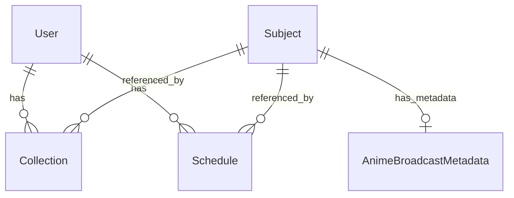

# Models 模块 — ORM 数据库模型

## 模块简介

使用 **SQLModel**（基于 SQLAlchemy + Pydantic）定义的数据库表结构。
每个模型类同时是 ORM 映射类 和 数据验证 Schema（SQLModel 特性）。

## ER 关系图



## 核心模型一览

| 模型 | 表名 | 核心字段 | 唯一约束 |
|------|------|----------|----------|
| `Subject` | subjects | id, source, source_id, type, name, name_cn, summary, tags, images | — |
| `Collection` | collections | id, user_id, source, source_id, type, rate, comment, tags | `(user_id, source, source_id)` |
| `User` | users | id, username, avatar_url, bangumi_id | `username` |
| `Schedule` | schedules | id, user_id, source, source_id, day_of_week, start_time | `(user_id, source, source_id)` |
| `AnimeBroadcastMetadata` | anime_broadcast_metadata | bangumi_id, title, broadcast_begin, year, season | — |

## 文件结构说明

```
models/
├── __init__.py              # 导出所有模型
├── enums.py                 # 枚举类型
├── subject.py               # Subject — 通用条目模型
├── collection.py            # Collection — 用户收藏模型
├── user.py                  # User — 用户模型
├── schedule.py              # Schedule — 番剧排班模型
└── broadcast_metadata.py    # AnimeBroadcastMetadata — 番剧放送元数据
```

### enums.py — 枚举定义 ([源码](enums.py))

- `SubjectType`: 1=书籍, 2=动画, 3=音乐, 4=游戏, 6=三次元
- `CollectionStatus`: 1=想看, 2=看过, 3=在看, 4=搁置, 5=抛弃
- `WatchType`: 1=饭点, 2=闲暇, 3=长草, 4=新番

### subject.py — 通用条目 ([源码](subject.py))

多数据源兼容（Bangumi / 豆瓣），字段覆盖 Bangumi API 的两种返回格式：
- Type A（收藏列表中的嵌套 subject）：`id, name, name_cn, images, tags`
- Type B（条目详情）：完整字段 + `summary, date, platform, meta_tags`

tags 存储为 `JSON` 列（`List[Dict[str, Any]]`），保留原始标签结构。

### collection.py — 用户收藏 ([源码](collection.py))

通过 `(user_id, source, source_id)` 唯一约束保证用户对同一条目只有一条收藏记录。
`tags` 为用户自定义标签（`List[str]`），与 Subject 的 tags 不同。

### user.py — 用户 ([源码](user.py))

极简用户模型，支持头像 URL 和 Bangumi ID 绑定。

### schedule.py — 番剧排班 ([源码](schedule.py))

用户自定义的观看排班，`day_of_week` 为 1-7 的星期数，`start_time` 为放送时间。

### broadcast_metadata.py — 放送元数据 ([源码](broadcast_metadata.py))

从 bangumi-data 项目同步的番剧首播信息缓存，`bangumi_id` 作为主键，提供 `year + season` 筛选。

## 依赖关系

**被谁调用**：
- `repositories/` — 所有 Repo 通过 ORM 查询和操作
- `db/database.py` — `SQLModel.metadata.create_all` 自动建表
- `api/deps.py` — `get_current_user` 查询 User

**调用谁**：
- `enums.py` — 被所有模型引用
- 无其他内部依赖
