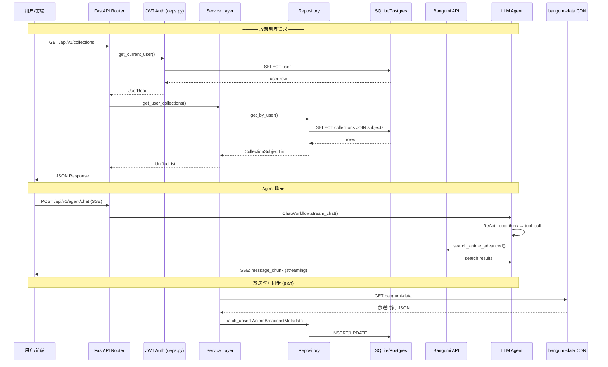

# 后端深度调研与架构白皮书

> OtakuNeko V2 — 二次元动画推荐系统
> 审计日期：2026-05-09 | 审计范围：`backend/app/` + `backend/alembic/` 全量代码

---

## 一、全局架构图

### 1.1 分层架构拓扑

```mermaid
graph TB
    subgraph "External"
        BGM[Bangumi API<br/>api.bgm.tv]
        BGM_WEB[Bangumi Web<br/>bgm.tv HTML]
        BGM_DATA[bangumi-data CDN<br/>放送时间数据]
        DOU[豆瓣 API]
        QB[qBittorrent]
        LLM[OpenAI / 兼容 API<br/>LLM 推理]
    end

    subgraph "Entry Point"
        FAST[FastAPI App<br/>main.py]
        LIFESPAN[lifespan: init_db + cache]
    end

    subgraph "API Layer (api/)"
        AGENT[POST /chat<br/>SSE Stream]
        AUTH[POST /auth/*]
        COLL[/collections/*]
        SUBJ[/subjects/*]
        DASH[/dashboard/*]
        SCD[/schedules/*]
        BANG[/bangumi/*]
        RSS[/rss/*]
    end

    subgraph "Agent Layer (agents/)"
        GRAPH[ChatWorkflow<br/>LangGraph ReAct]
        TOOLS[7 Tools<br/>@tool functions]
    end

    subgraph "Business Layer (services/)"
        BGM_SVC[BangumiService]
        BGM_CLI[BangumiClient<br/>API Client]
        HTML_CLI[BangumiClient<br/>HTML Scraper]
        SYNC_SVC[BangumiDataSyncService<br/>bangumi-data 同步]
        COL_SVC[CollectionService]
        SUB_SVC[SubjectService]
        SCH_SVC[ScheduleService]
        STAT_SVC[StatsService]
        PROF_SVC[UserProfileService]
        DOU_SVC[DoubanService]
        QB_SVC[QBService]
    end

    subgraph "Data Layer (models/ + repositories/)"
        REPO[Repositories<br/>4 个：Subject/Collection/User/Schedule]
        MODELS[SQLModel ORM<br/>6 张表]
        DB_ENGINE[(SQLite / PostgreSQL<br/>Dual-mode)]
    end

    subgraph "Infrastructure"
        CONFIG[config.py<br/>Settings]
        LOG[logging.py<br/>RotatingFile + RequestFilter]
        SECURITY[security.py<br/>JWT + bcrypt]
        ADAPTER[adaptersV2.py<br/>Format Converters]
        ALEMBIC[Alembic<br/>3 个迁移脚本]
    end

    subgraph "Workers (planned)"
        CELERY[Celery<br/>TODO]
    end

    FAST --> AGENT
    FAST --> AUTH
    FAST --> COLL --> COL_SVC --> REPO --> MODELS --> DB_ENGINE
    FAST --> SUBJ --> SUB_SVC --> REPO
    FAST --> DASH --> STAT_SVC --> REPO
    FAST --> SCD --> SCH_SVC --> REPO
    FAST --> BANG --> BGM_SVC --> BGM_CLI --> BGM
    FAST --> RSS --> QB_SVC --> QB

    AGENT --> GRAPH --> TOOLS --> BGM_SVC
    GRAPH --> TOOLS --> PROF_SVC
    TOOLS --> BGM_CLI

    BGM_SVC --> HTML_CLI --> BGM_WEB
    BGM_CLI --> BGM
    SYNC_SVC --> BGM_CLI
    SYNC_SVC --> BGM_DATA

    DOU_SVC --> DOU
    DOU_SVC --> ADAPTER

    CONFIG --> DB_ENGINE
    CONFIG --> FAST
    SECURITY --> AUTH
    LOG --> SERVICES & REPOSITORIES
    ALEMBIC --> MODELS

    style PROF_SVC fill:#ffd700,stroke:#333
    style GRAPH fill:#4ecdc4,stroke:#333
    style TOOLS fill:#4ecdc4,stroke:#333
    style ADAPTER fill:#a8e6cf,stroke:#333
    style CELERY fill:#ff6b6b,stroke:#333
    style SYNC_SVC fill:#b8e986,stroke:#333
    style ALEMBIC fill:#74b9ff,stroke:#333
```

### 1.2 数据流全景



---

## 二、核心业务流转解析

### 2.1 数据如何从路由层流向数据库层

```
POST /api/v1/collections → collections.py router
    → Depends(get_current_user) → deps.py → JWT decode → User model
    → Depends(get_session) → db/database.py → AsyncSession
    → collection_service.create_collection() → collection_service.py
        → CollectionRepo.create() → collection_repo.py
            → SQLAlchemy INSERT → SQLite/PostgreSQL
        → return CollectionRead → Pydantic serialization → JSON
```

| 层级 | 目录 | 职责 |
|------|------|------|
| **路由层** | `api/v1/` | 处理 HTTP 请求/响应，验证输入格式，不做业务逻辑 |
| **服务层** | `services/` | 编排业务逻辑，协调多个 Repository 和外部 API |
| **仓库层** | `repositories/` | 封装数据库 CRUD，内部处理事务和缓存失效 |
| **模型层** | `models/` | SQLModel 定义 ORM，SQLAlchemy 管理实际 SQL |

### 2.2 Agent 工作流（核心创新点）

```
User Message → graph.py (LangGraph)
    → agent node: ChatOpenAI.ainvoke() → LLM 推理
        → 决定调用 tool?
            ├── YES → tools node: ToolNode.execute()
            │          → 调用 services/ 执行实际逻辑
            │          → 结果返回 agent node 继续推理
            └── NO  → END → 流式返回最终回复
```

**7 个工具及其调用链路：**

| Tool | 调用链 | 数据来源 |
|------|--------|----------|
| `get_anime_info` | `tools.py` → `bangumi_service.fetch_subject_by_id` | Bangumi API |
| `fetch_audience_reviews` | `tools.py` → `bangumi_service.get_audience_feedback` → `BangumiClient` (HTML Scraper) | bgm.tv 网页 |
| `get_anime_staff` | `tools.py` → `bangumi_service.get_staff_info` | Bangumi API |
| `get_anime_cast` | `tools.py` → `bangumi_service.get_cast_info` | Bangumi API |
| `search_anime_advanced` | `tools.py` → `bangumi_client.search_subjects_advanced` | Bangumi API |
| `get_current_time` | `tools.py` → `datetime.now()` | 本地系统时钟 |
| `generate_user_profile_tool` | `tools.py` → `user_profile_service.generate_user_profile` | 数据库（用户收藏） |

> **已知限制**：`generate_user_profile_tool` 当前需要前端传入完整收藏数据，无法自动通过 `user_id` 查询数据库。这是高优先级待办项。

### 2.3 数据格式适配流程（adaptersV2.py）

```
外部数据源 (Bangumi JSON / 豆瓣 JSON)
    ↓
adaptersV2.py 转换函数
    ├── bangumi_subject_to_subjectlist()     → SubjectUpsertList
    ├── bangumi_collection_to_collectionlist() → CollectionUpsertList
    ├── douban_to_bangumi_list()             → 豆瓣→Bangumi 格式
    ├── bangumi_calendar_to_subject_upsert_list() → 日历→Subject
    └── convert_to_collection_subject_list()  → 统一视图
    ↓
内部 Schema (SubjectUpsert / CollectionUpsert / UnifiedList)
    ↓
Repository batch_upsert / batch_update
    ↓
数据库 (SQLite / PostgreSQL)
    ↓
统一视图 UnifiedList / UnifiedCollectionSubject → 前端
```

### 2.4 双模式部署架构

```
DEPLOY_MODE=local  → SQLite (sqlite+aiosqlite:///./local.db)
                    → InMemory Cache
                    → 无需 PostgreSQL / Redis

DEPLOY_MODE=cloud  → PostgreSQL (postgresql+asyncpg://...)
                    → Redis (当前降级为 InMemory，生产待修复)
                    → 完整生产栈 (Docker Compose)
```

### 2.5 bangumi-data 放送时间同步（较新功能）

```
外部 CDN (jsdelivr / unpkg)
    ↓
BangumiDataSyncService.fetch_and_sync_recent_data()
    ├── 下载 bangumi-data JSON（多数据源 + 3 次重试）
    ├── 按日期范围过滤（±90 天）
    ├── 白名单平台筛选（巴哈/ B站/ Netflix/ Disney+ 等）
    ├── 取最早放送时间（多平台取 min）
    └── batch_upsert → AnimeBroadcastMetadata 表
```

---

## 三、模块完整度矩阵

| 模块 | README | 代码实现 | 状态与说明 |
|------|--------|----------|------------|
| `core/` | ✅ | 3/3 完成 | config/logging/security；logging 含 RequestContextFilter + ConcurrentRotatingFileHandler |
| `db/` | ✅ | 1/1 完成 | 双模引擎 (SQLite + PostgreSQL) |
| `alembic/` | — | 3 迁移 | `2739cf...` (source 字段), `bbd933...` (ID 类型), `e567b8...` (索引优化) |
| `models/` | ✅ | 7 类 / 6 表 | Subject, Collection, User, Schedule, AnimeBroadcastMetadata + SubjectType/CollectionStatus/WatchType 枚举 |
| `schemas/` | ✅ | 11 文件 | ~80+ Schema 类；adaptersV2 为格式转换引擎 |
| `repositories/` | ✅ | 4/4 完成 | SubjectRepo, CollectionRepo, UserRepo, ScheduleRepository |
| `services/` | ✅ | 11/11 完成 | 全部实现，含新增的 bangumi_data_sync + douban_service |
| `clients/` | ✅ | 1/1 完成 | BangumiClient (HTML Scraper: 短评/长评) |
| `api/` | ✅ | 9/9 完成 | RESTful + SSE；9 个路由文件，~30+ 端点 |
| `agents/` | ✅ | 2/2 完成 | ReAct Workflow + 7 tools；nodes/ 目录仍为空 |
| `worker/` | ✅ | **0/2** | TODO — Celery 占位未实现 |

---

## 四、技术债与优化建议

### 🔴 高优先级

| # | 问题 | 位置 | 建议 |
|---|------|------|------|
| 1 | **用户画像无独立 API** | `services/user_profile_service.py` | 新增 `GET /api/v1/user/profile`，从数据库自动拉取用户收藏生成画像 JSON |
| 2 | **agent tool 无法自动获取收藏数据** | `agents/tools.py#generate_user_profile_tool` | 改为接受 `user_id` 参数，内部查询数据库获取收藏 |
| 3 | **Celery 占位未实现** | `worker/celery_app.py` | 实现定时同步任务（Bangumi 收藏 + 日历 + bangumi-data 放送时间 + 画像批量生成） |
| 4 | **两套 BangumiClient 并存** | `clients/bangumi_client.py` vs `services/bangumi_client.py` | 前者是 HTML Scraper，后者是 API Client；建议重命名 `clients/bangumi_scraper.py` 消除歧义 |
| 5 | **JWT SECRET_KEY 弱默认值** | `core/security.py` | `settings.OPENAI_API_KEY or "hardcoded-fallback"` 不安全；生产环境必须独立配置 |
| 6 | **Redis 缓存未真正启用** | `main.py` | 生产模式下仍降级为 InMemoryBackend（注释称"版本兼容性问题"），需修复 |

### 🟡 中优先级

| # | 问题 | 位置 | 建议 |
|---|------|------|------|
| 7 | **四象限分类未集成** | `user_profile_service.py#_extract_four_quadrants` | 将四象限结果加入 `generate_user_profile` 返回值 |
| 8 | **用户画像无缓存** | `services/user_profile_service.py` | 添加 TTL 缓存避免重复计算 |
| 9 | **DEBUG 日志残留** | `api/deps.py` (多个 `print("[DEBUG]...")` ) | 统一替换为 `logger.debug()` |
| 10 | **`__init__.py` 大量 TODO** | `services/__init__.py` 等 | 完善 module-level exports |
| 11 | **对旧版 Pydantic v1 的兼容代码** | `schemas/rss.py` `__get_validators__` | 迁移到 Pydantic v2 的 `@field_validator` |
| 12 | **repositories/__init__.py 未导出全量** | `repositories/__init__.py` | 仅导出了 SubjectRepo + CollectionRepo，缺少 UserRepo + ScheduleRepository |

### 🟢 低优先级

| # | 问题 | 位置 | 建议 |
|---|------|------|------|
| 13 | **nodes/ 目录空闲** | `agents/nodes/` | 实现自定义 LangGraph 节点（如意图识别/路由），或清理空文件 |
| 14 | **`package.json` / `package-lock.json`** | 后端根目录 | 后端不应用 Node.js 依赖，考虑清理 |
| 15 | **CORS allow_origins 硬编码** | `main.py` | 改为从 config 读取 |
| 16 | **无 API 速率限制** | 全局 | 添加 slowapi 或 nginx 限流 |
| 17 | **graph.py 每次请求 re-compile** | `agents/graph.py` | `workflow.compile()` 提到 `__init__` 复用，避免重复编译开销 |

---

## 五、量化指标

| 指标 | 数值 |
|------|------|
| 模块总数 | 11 |
| ORM 模型 | 7 个类, **6 张表**（Subject, Collection, User, Schedule, AnimeBroadcastMetadata + 3 个枚举） |
| Pydantic Schema | 11 个文件, ~80+ 个 Schema 类 |
| API 端点 | 9 个路由文件, ~30+ 个端点 |
| Repository | 4 个（SubjectRepo, CollectionRepo, UserRepo, ScheduleRepository） |
| Service | 11 个（全部完成） |
| LangChain Tool | 7 个 |
| Alembic 迁移 | 3 个（source 字段 / ID 类型 / 索引优化） |
| 外部依赖 | Bangumi API, Bangumi Web Scraper, bangumi-data CDN, 豆瓣 API, qBittorrent API, OpenAI/兼容 LLM |
| 数据库模式 | SQLite（本地）/ PostgreSQL（生产）自动切换 |
| 测试文件 | 18 个（`tests/` 10 个 + `backend/` 8 个脚本） |
| 容器化 | Docker + Docker Compose（5 个 service：db / redis / backend / qbittorrent / frontend） |

### 各层职责速查

| 层 | 文件数 | 核心职责 |
|----|--------|----------|
| API 路由层 | 9 | HTTP 接入、参数校验、用户鉴权、SSE 流式输出 |
| Agent 层 | 2 (+2 空节点) | LangGraph ReAct 工作流 + 7 个 tool 绑定 |
| Service 层 | 11 | 业务编排、外部 API 调用、数据清洗、缓存管理 |
| Repository 层 | 4 | 数据库 CRUD、批量 upsert、关联查询 |
| Model 层 | 5 模型 + 3 枚举 | ORM 定义、唯一约束、JSON 字段映射 |
| Schema 层 | 11 | Pydantic 验证、格式适配、统一视图转换 |
| Infrastructure | 3 | 配置管理、日志系统、安全模块 |

---

## 六、建议后续路线图

### 短期（1-2 周）
1. 补充用户画像 API 端点 + agent 自动拉取收藏（修复 #1、#2）
2. 将四象限结果集成到画像返回值（修复 #7）
3. 用户画像加 TTL 缓存（修复 #8）
4. 修复 JWT SECRET_KEY 安全漏洞（修复 #5）

### 中期（2-4 周）
5. 实现 Celery 定时任务（修复 #3）
   - Bangumi 收藏增量同步
   - Bangumi 日历定时拉取
   - bangumi-data 放送时间周期更新
   - 用户画像离线预计算
6. 清理 DEBUG 日志 + 完善 `__init__.py` exports（修复 #9、#10、#12）
7. CORS 配置化 + API 速率限制（修复 #15、#16）

### 长期（1 月+）
8. Agent 架构升级：ReAct → Plan-and-Execute + 意图路由节点（修复 #13）
9. 引入 RAG（向量数据库 + embedding）+ Agent Memory（Checkpoint 持久化）
10. 添加单元测试、集成测试、CI/CD pipeline

---

_本白皮书基于 `backend/app/` + `backend/alembic/` 全量源码静态分析，经人工复核后生成。_
